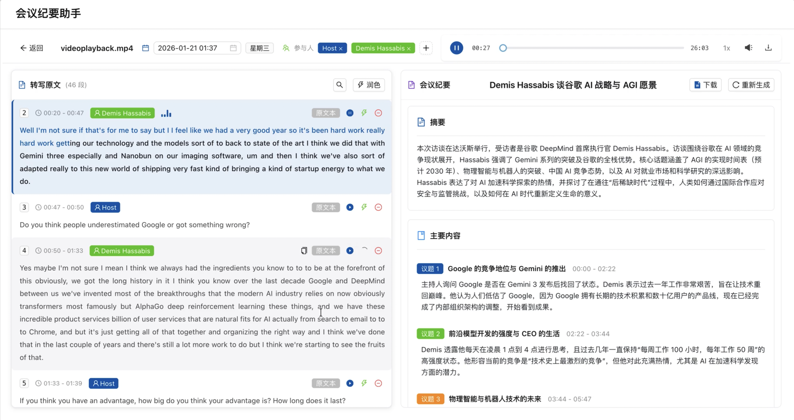

<div align="center">

<h3>开箱即用的本地私有化部署语音识别服务</h3>

基于 [FunASR](https://github.com/alibaba-damo-academy/FunASR) 和 [Qwen3-ASR](https://github.com/QwenLM/Qwen3-ASR) 的语音识别 API 服务，提供高精度中文语音识别(ASR)功能，兼容阿里云语音 API 和 OpenAI Audio API。

---


</div>

## 在线演示站点

- **在线体验**: https://asr.vect.one

## 演示

[](https://media.cdn.vect.one/qwenasr_client_demo.mp4)

## 主要特性

- **多模型支持** - 集成 [Qwen3-ASR](https://github.com/QwenLM/Qwen3-ASR) 1.7B/0.6B 和 Paraformer Large 高质量 ASR 模型
- **说话人分离** - 基于 CAM++ 模型自动识别多说话人，返回说话人标记
- **OpenAI API 兼容** - 支持 `/v1/audio/transcriptions` 端点，可直接使用 OpenAI SDK
- **阿里云 API 兼容** - 支持阿里云语音识别 RESTful API 和 WebSocket 流式协议
- **WebSocket 流式识别** - 支持实时流式语音识别，低延迟
- **智能远场过滤** - 流式 ASR 自动过滤远场声音和环境音，减少误触发
- **智能音频分段** - 基于 VAD 的贪婪合并算法，自动切分长音频，避免包含过长静音
- **GPU 批处理加速** - 支持批量推理，比逐个处理快 2-3 倍
- **灵活配置** - 支持环境变量配置，按需加载模型

## 快速部署

### 1. Docker 部署(推荐)

```bash
# 复制并编辑配置
cp .env.example .env
# 编辑 .env 设置 ENABLED_MODELS 和 API_KEY（可选）

# 启动服务（GPU 版本）
docker-compose up -d

# 或 CPU 版本
docker-compose -f docker-compose-cpu.yml up -d
```

服务访问地址：
- **API 端点**: `http://localhost:17003`
- **API 文档**: `http://localhost:17003/docs`

**docker run 方式（替代）:**

```bash
# GPU 版本
docker run -d --name funasr-api \
  --gpus all \
  -p 17003:8000 \
  -e ENABLED_MODELS=auto \
  -e API_KEY=your_api_key \
  -v ./models/modelscope:/root/.cache/modelscope \
  -v ./models/huggingface:/root/.cache/huggingface \
  quantatrisk/funasr-api:gpu-latest

# CPU 版本
docker run -d --name funasr-api \
  -p 17003:8000 \
  -e ENABLED_MODELS=paraformer-large \
  quantatrisk/funasr-api:cpu-latest
```

> **注意**: CPU 环境自动过滤 Qwen3 模型（vLLM 需要 GPU）

**内网部署**：使用辅助脚本准备模型，然后复制到内网机器：

```bash
# 1. 准备模型（交互式选择）
./scripts/prepare-models.sh

# 2. 复制到内网服务器
scp funasr-models-*.tar.gz user@server:/opt/funasr-api/

# 3. 在内网服务器解压并启动
tar -xzvf funasr-models-*.tar.gz
docker-compose up -d
```

详见 [MODEL_SETUP.md](./MODEL_SETUP.md)

> 详细部署说明请查看 [部署指南](./deployment.md)

### 本地开发

**系统要求:**

- Python 3.10+
- CUDA 12.6+ (可选，用于 GPU 加速)
- FFmpeg (音频格式转换)

**安装步骤:**

```bash
# 克隆项目
cd FunASR-API

# 安装依赖
pip install -r requirements.txt

# 启动服务
python start.py
```

## API 接口

### OpenAI 兼容接口

| 端点                         | 方法 | 功能                    |
| ---------------------------- | ---- | ----------------------- |
| `/v1/audio/transcriptions` | POST | 音频转写（OpenAI 兼容） |
| `/v1/models`               | GET  | 模型列表                |

**请求参数:**

| 参数                           | 类型   | 默认值                | 说明                                  |
| ------------------------------ | ------ | --------------------- | ------------------------------------- |
| `file`                       | file   | 与 `audio_address` 二选一 | 音频文件                              |
| `audio_address`              | string | 与 `file` 二选一      | 音频文件 URL（HTTP/HTTPS）            |
| `model`                      | string | 自动检测              | 模型选择 (qwen3-asr-1.7b, qwen3-asr-0.6b, paraformer-large) |
| `language`                   | string | 自动检测              | 语言代码 (zh/en/ja)                   |
| `enable_speaker_diarization` | bool   | `true`              | 启用说话人分离                        |
| `word_timestamps`            | bool   | `true`              | 返回字词级时间戳（仅Qwen3-ASR支持）  |
| `response_format`            | string | `verbose_json`      | 输出格式                              |
| `prompt`                     | string | -                     | 提示文本（保留兼容）                  |
| `temperature`                | float  | `0`                   | 采样温度（保留兼容）                  |

**音频输入方式:**
- **文件上传**: 使用 `file` 参数上传音频文件（标准 OpenAI 方式）
- **URL 下载**: 使用 `audio_address` 参数提供音频 URL，服务将自动下载

**使用示例:**

```python
# 使用 OpenAI SDK
from openai import OpenAI

client = OpenAI(base_url="http://localhost:8000/v1", api_key="your_api_key")

with open("audio.wav", "rb") as f:
    transcript = client.audio.transcriptions.create(
        model="whisper-1",  # 会映射到默认模型
        file=f,
        response_format="verbose_json"  # 获取分段和说话人信息
    )
print(transcript.text)
```

```bash
# 使用 curl
curl -X POST "http://localhost:8000/v1/audio/transcriptions" \
  -H "Authorization: Bearer your_api_key" \
  -F "file=@audio.wav" \
  -F "model=paraformer-large" \
  -F "response_format=verbose_json" \
  -F "enable_speaker_diarization=true"
```

**支持的响应格式:** `json`, `text`, `srt`, `vtt`, `verbose_json`

### 阿里云兼容接口

| 端点                      | 方法      | 功能                   |
| ------------------------- | --------- | ---------------------- |
| `/stream/v1/asr`        | POST      | 语音识别（支持长音频） |
| `/stream/v1/asr/models` | GET       | 模型列表               |
| `/stream/v1/asr/health` | GET       | 健康检查               |
| `/ws/v1/asr`            | WebSocket | 流式语音识别（阿里云协议兼容） |
| `/ws/v1/asr/funasr`     | WebSocket | FunASR 流式识别（向后兼容）   |
| `/ws/v1/asr/qwen`       | WebSocket | Qwen3-ASR 流式识别           |
| `/ws/v1/asr/test`       | GET       | WebSocket 测试页面           |

**请求参数:**

| 参数                           | 类型   | 默认值             | 说明                                  |
| ------------------------------ | ------ | ------------------ | ------------------------------------- |
| `model_id`                   | string | 自动检测         | 模型 ID                               |
| `audio_address`              | string | -                  | 音频 URL（可选）                      |
| `sample_rate`                | int    | `16000`          | 采样率                                |
| `enable_speaker_diarization` | bool   | `true`           | 启用说话人分离                        |
| `word_timestamps`            | bool   | `true`           | 返回字词级时间戳（仅Qwen3-ASR支持）  |
| `vocabulary_id`              | string | -                  | 热词（格式：`词1 权重1 词2 权重2`） |

**使用示例:**

```bash
# 基本用法
curl -X POST "http://localhost:8000/stream/v1/asr" \
  -H "Content-Type: application/octet-stream" \
  --data-binary @audio.wav

# 带参数
curl -X POST "http://localhost:8000/stream/v1/asr?enable_speaker_diarization=true" \
  -H "Content-Type: application/octet-stream" \
  --data-binary @audio.wav
```

**响应示例:**

```json
{
  "task_id": "xxx",
  "status": 200,
  "message": "SUCCESS",
  "result": "说话人1的内容...\n说话人2的内容...",
  "duration": 60.5,
  "processing_time": 1.234,
  "segments": [
    {
      "text": "今天天气不错。",
      "start_time": 0.0,
      "end_time": 2.5,
      "speaker_id": "说话人1",
      "word_tokens": [
        {"text": "今天", "start_time": 0.0, "end_time": 0.5},
        {"text": "天气", "start_time": 0.5, "end_time": 0.9},
        {"text": "不错", "start_time": 0.9, "end_time": 1.3}
      ]
    }
  ]
}
```

**WebSocket 流式识别测试:** 访问 `http://localhost:8000/ws/v1/asr/test`

## 说话人分离

基于 CAM++ 模型实现多说话人自动识别：

- **默认开启** - `enable_speaker_diarization=true`
- **自动识别** - 无需预设说话人数量，模型自动检测
- **说话人标记** - 响应中包含 `speaker_id` 字段（如 "说话人1"、"说话人2"）
- **智能合并** - 两层合并策略避免孤立短片段：
  - 第一层：小于10秒的同说话人片段累积合并
  - 第二层：连续片段累积合并至60秒上限
- **字幕支持** - SRT/VTT 格式输出包含说话人标记 `[说话人1] 文本内容`

关闭说话人分离：

```bash
# OpenAI API
-F "enable_speaker_diarization=false"

# 阿里云 API
?enable_speaker_diarization=false
```

## 音频处理

### 智能分段策略

长音频自动分段处理：

1. **VAD 语音检测** - 检测语音边界，过滤静音
2. **贪婪合并** - 累积语音段，确保每段不超过 `MAX_SEGMENT_SEC`（默认90秒）
3. **静音切分** - 语音段间静音超过3秒时强制切分，避免包含过长静音
4. **批处理推理** - 多片段并行处理，GPU 模式下性能提升 2-3 倍

### WebSocket 流式识别限制

**FunASR 模型限制**（使用 `/ws/v1/asr` 或 `/ws/v1/asr/funasr`）：
- ✅ 实时语音识别、低延迟
- ✅ 字句级时间戳
- ❌ **词级时间戳**（未实现）
- ❌ **置信度分数**（未实现）

**Qwen3-ASR 流式**（使用 `/ws/v1/asr/qwen`）：
- ✅ 支持词级时间戳
- ✅ 支持多语言实时识别

## 支持的模型

| 模型 ID              | 名称              | 说明                                     | 特性      |
| -------------------- | ----------------- | ---------------------------------------- | --------- |
| `qwen3-asr-1.7b`   | Qwen3-ASR 1.7B    | 高性能多语言ASR，52种语言+方言，vLLM后端 | 离线/实时 |
| `qwen3-asr-0.6b`   | Qwen3-ASR 0.6B    | 轻量版多语言ASR，适合小显存环境          | 离线/实时 |
| `paraformer-large` | Paraformer Large  | 高精度中文语音识别                       | 离线/实时 |

**模型选择:**

使用 `ENABLED_MODELS` 环境变量控制加载哪些模型：

```bash
# 选项: auto, all, 或逗号分隔列表
ENABLED_MODELS=auto                    # 自动检测 GPU 加载合适模型
ENABLED_MODELS=all                     # 加载所有可用模型
ENABLED_MODELS=paraformer-large        # 仅 Paraformer
ENABLED_MODELS=qwen3-asr-0.6b          # 仅 Qwen3 0.6B
ENABLED_MODELS=paraformer-large,qwen3-asr-0.6b  # 两者都加载
```

**Auto 模式行为:**
- **显存 >= 32GB**: 自动加载 `qwen3-asr-1.7b` + `paraformer-large`
- **显存 < 32GB**: 自动加载 `qwen3-asr-0.6b` + `paraformer-large`
- **无 CUDA**: 仅 `paraformer-large`（Qwen3 需要 vLLM/GPU）

## 环境变量

| 变量                               | 默认值       | 说明                                            |
| ---------------------------------- | ------------ | ----------------------------------------------- |
| `ENABLED_MODELS`                 | `auto`       | 加载模型: `auto`, `all`, 或逗号分隔列表       |
| `API_KEY`                        | -            | API 认证密钥（可选，未配置时无需认证）        |
| `LOG_LEVEL`                      | `INFO`       | 日志级别（DEBUG/INFO/WARNING/ERROR）          |
| `MAX_AUDIO_SIZE`                 | `2048`       | 最大音频文件大小（MB，支持单位如 2GB）        |
| `ASR_BATCH_SIZE`                 | `4`          | ASR 批处理大小（GPU 建议 4，CPU 建议 2）      |
| `MAX_SEGMENT_SEC`                | `90`         | 音频分段最大时长（秒）                        |
| `ENABLE_STREAMING_VLLM`          | `false`      | 是否加载流式 VLLM 实例（节省显存）            |
| `MODELSCOPE_PATH`                | `~/.cache/modelscope/hub/models` | ModelScope 缓存路径 |
| `HF_HOME`                        | `~/.cache/huggingface` | HuggingFace 缓存路径（GPU 模式）     |
| `ASR_ENABLE_LM`                  | `true`       | 是否启用语言模型（Paraformer）                |
| `ASR_ENABLE_NEARFIELD_FILTER`    | `true`       | 启用远场声音过滤                              |

> 详细配置说明请查看 [远场过滤文档](./nearfield_filter.md)

## 资源需求

**最小配置（CPU）:**

- CPU: 4 核
- 内存: 16GB
- 磁盘: 20GB

**推荐配置（GPU）:**

- CPU: 4 核
- 内存: 16GB
- GPU: NVIDIA GPU (16GB+ 显存)
- 磁盘: 20GB

## API 文档

启动服务后访问：

- Swagger UI: `http://localhost:8000/docs`
- ReDoc: `http://localhost:8000/redoc`

## 相关链接

- **部署指南**: [详细文档](./deployment.md)
- **远场过滤配置**: [配置指南](./nearfield_filter.md)
- **FunASR**: [FunASR GitHub](https://github.com/alibaba-damo-academy/FunASR)

## 许可证

本项目采用 MIT 许可证 - 查看 [LICENSE](../LICENSE) 文件了解详情。

## Star 历史

[](https://star-history.com/#Quantatirsk/funasr-api&Date)

## 贡献

欢迎提交 Issue 和 Pull Request 来改进项目!
